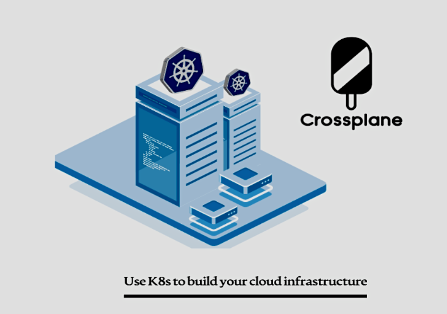
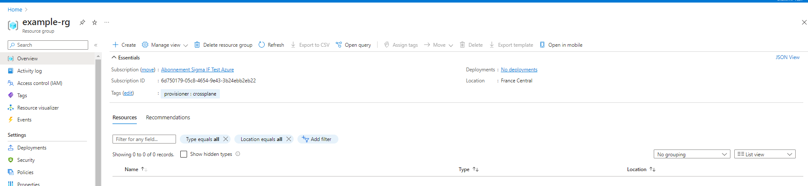

# sUse K8s to build your cloud infrastructure
Your run your applications into  a *kubernetes* cluster and you need to build your cloud infrastructure , using the Iinfrastructure as a code is a good solution ( tools like Terraform , Ansible or
some provider Iacc tools like Aws CloudFormation can be so helpful ) ,

on the one hand, we have Infrastructure as Code tools that require an increase in skills to use them well. On the other hand, *kubernetes* is increasingly becoming the standard for running applications.
But what if you have a toolsthat combines all of the above!  With Crossplane “Provision and manage cloud infrastructure and services using kubectl”

[](doc-images/crossplane-k8s.PNG)

## What is Crossplane?
Like it is defined by the Crossplane community:  Crossplane is an open source, CNCF project built on the foundation of *kubernetes* to orchestrate anything.
Crossplane can be considered as a *kubernetes* add-on, which means that it makes use of custom resources to provide all of its functionality

## Prerequisites

. k8s cluster version v1.16.0 or later
. kubectl
. Helm version v3.2.0 or later
### Install Crossplane

Crossplane installs into an existing *kubernetes* cluster(in my case I am using an Azure *kubernetes* cluster "aks" with 1.24.6 k8s version),
creating the Crossplane pod, enabling the installation of Crossplane Provider resources.

- Install the Up command-line
```bash
$ curl -sL "https://cli.upbound.io" | sh
$ sudo mv up /usr/local/bin/
```
- Install Upbound Universal Crossplane
Upbound Universal Crossplane (UXP) consists of upstream Crossplane and Upbound-specific enhancements and patches.

```bash
$ up uxp install
```
- Verify all Crossplane pods are Running with:
```bash
$ kubectl get pods -n upbound-system
  NAME                                       READY   STATUS    RESTARTS   AGE
  crossplane-858644b564-7tknf                1/1     Running   0          92s
  crossplane-rbac-manager-557ff7d969-sz4fl   1/1     Running   0          92s

$ kubectl get deploy -n upbound-system
  NAME                      READY   UP-TO-DATE   AVAILABLE   AGE
  crossplane                1/1     1            1           2m44s
  crossplane-rbac-manager   1/1     1            1           2m44s
```
* The Crossplane deployment starts with the crossplane-init container. The init container installs the Crossplane Custom Resource Definitions into the *kubernetes* cluster.

After the init container finishes, the crossplane pod manages two *kubernetes* controllers.

- The Package Manager controller installs the provider and configuration packages.
- The Composition controller installs and manages the Crossplane Composite Resource Definitions, Compositions and Claims.

* Crossplane-rbac-manager deployment :
The crossplane-rbac-manager creates and manages *kubernetes* ClusterRoles for installed Crossplane Provider and their Custom Resource Definitions.
to check all the installed objects run the command :
Installing UXP and Crossplane creates new *kubernetes* API end-points. Take a look at the new API end-points with
```bash
$ kubectl api-resources | grep crossplane.
  compositeresourcedefinitions       xrd,xrds            apiextensions.crossplane.io/v1         false        CompositeResourceDefinition
  compositionrevisions                                   apiextensions.crossplane.io/v1beta1    false        CompositionRevision
  compositions                                           apiextensions.crossplane.io/v1         false        Composition
  environmentconfigs                                     apiextensions.crossplane.io/v1alpha1   false        EnvironmentConfig
  configurationrevisions                                 pkg.crossplane.io/v1                   false        ConfigurationRevision
  configurations                                         pkg.crossplane.io/v1                   false        Configuration
  controllerconfigs                                      pkg.crossplane.io/v1alpha1             false        ControllerConfig
  locks                                                  pkg.crossplane.io/v1beta1              false        Lock
  providerrevisions                                      pkg.crossplane.io/v1                   false        ProviderRevision
  providers                                              pkg.crossplane.io/v1                   false        Provider
  storeconfigs                                           secrets.crossplane.io/v1alpha1         false        StoreConfig

```
In a later step you use the Provider resource install the Official Provider

### Install the official Azure provider
- Install the Azure provider
```bash
$ kubectl apply -f provider.yaml
```
- Check the provider installed :
```bash
 $ kubectl get providers
   NAME                     INSTALLED   HEALTHY   PACKAGE                                          AGE
upbound-provider-azure   True        True      xpkg.upbound.io/upbound/provider-azure:v0.16.0   30s
$ kubectl get deploy -n upbound-system
  crossplane-858644b564-qzzvr                  1/1     Running   8 (3m4s ago)     52m
  crossplane-rbac-manager-557ff7d969-xn8tq     1/1     Running   11 (5m58s ago)   52m
  provider-azure-7d18dc218f1e-5f8b947c-q96jb   1/1     Running   9 (6m58s ago)    45m
```
> A provider installs their own *kubernetes* Custom Resource Definitions (CRDs). These CRDs allow you to create Azure resources directly inside *kubernetes*.
```bash
$ kubectl get crds
```
- Create a *kubernetes* secret for Azure

Log in to the Azure command-line, and Create an Azure service principal
```bash
$ az ad sp create-for-rbac \
  --sdk-auth \
  --role Owner \
  --scopes /subscriptions/6d750179-05c8-4654-9e43-3b24ebb2eb22
```

> Save your Azure JSON output as azure-credentials.json.

Create a *kubernetes* secret with the Azure credentials
```bash
 $ kubectl create secret \
   generic azure-secret \
   -n upbound-system \
   --from-file=creds=./azure-credentials.json
```

view the secret with :
```bash
$ kubectl get secret
  NAME                                         TYPE                 DATA   AGE
  azure-secret                                 Opaque               1      27s
  sh.helm.release.v1.universal-crossplane.v1   helm.sh/release.v1   1      18m

$ kubectl describe secret azure-secret -n upbound-system
  Name:         azure-secret
  Namespace:    upbound-system
  Labels:       <none>
  Annotations:  <none>

  Type:  Opaque

  Data
  ====
  creds:  661 bytes
```
- Create a ProviderConfig
Now we need to tell our new provider to use the credentials of the crossplane
```bash
$ kubectl apply -f ProviderConfig.yaml
```
> This attaches the Azure credentials, saved as a *kubernetes* secret, as a secretRef .

### Create a managed resource
We will use Crossplane to  create an azure resource group and then deploy an Linux virtuel machine in this resource group

- Create the azure resource group :
```bash
$ kubectl apply -f - resource-group.yaml
```
check the created resource :
```bash
$ kubectl get ResourceGroup
  NAME         READY   SYNCED   EXTERNAL-NAME   AGE
  example-rg   True    True     example-rg      2d21h
```
Wait until the state is Synced on the resources, they will now reflect in Azure.
[](doc-images/exemple-rg.PNG)

One benefit of using *kubernetes* declarative APIs is that it takes care of the configuration drift. Try deleting the storage account from portal and see them get re-created.

- To delete the resouce :
```bash
$ Kubectl delete ResourceGroup example-rg
```